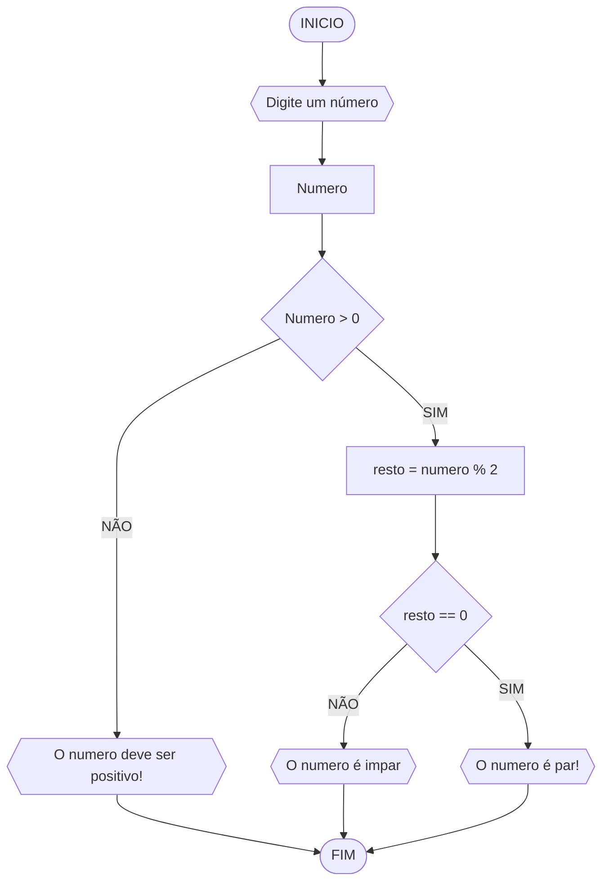

## UNIFOR

**disciplina** Raciocinio logico algoritmico
**orientador** Prof Ricardo Carubbi

## lista de exercicios

### exercicio 03

#### Fluxograma

#### Pseudocodigo 
```
ALGORITMO verifica_par_impar
DECLARE numero, resto NUMERICO: "
ESCREVA "Digite um número: "
LEIA numero
SE numero >= 0 ENTAO
	resto <-  numero % 2 
	SE resto == 0 ENTAO
		ESCREVA "o numero é par!"
	SENAO
		ESCREVA "o numero é impar!"
	SENAO 
		ESCREVA "o numero deve ser positivo"
	FIM_ALGORITMO			
